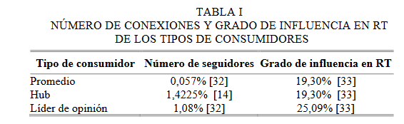
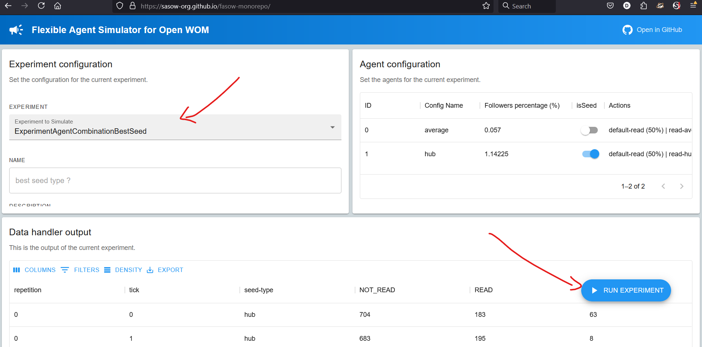

# Agent Seed Combination

Para implementar el caso de [Whom do I Choose to Diffuse Information on
Twitter? An Agent-Based Model Approach](https://pleger.cl/cv-pleger/papers/arayaAl-ieeelatam2019.pdf)
necesitaremos crear dos Calibraciones diferentes. Para ambos casos vamos a implementar una campania
de marketing WOM, simulando a la red social twitter, ahora conocido como X. La campania trata sobre
como los usuarios semilla son quienes inician la campania de marketing enviando un mensaje a sus seguidores,
quienes al recibir el mensaje podran decidir sobre compartirlo con otros o no.

Lo importante a rastrear en este caso es conocer que tipos de usuarios son mejores para ser agentes semillas.
Los tipos de usuarios se definen como: Hub (con una gran cantidad de seguidres,
y con una probabilidad promedio de compartir el mensaje), Leader (con una cantidad considerable de seguidores, aunque
menor que los de HUB, pero mayor que el promedio y una probabilidad de compartir promedio), y Average (
con una cantidad de seguidores y probabilidad de compartir el mensaje promedio)

Ademas, la red social debe tener 10000 usuarios, y de ese total el 5% corresponde a usuarios o consumidores semilla,
mientras que el otro porciento seran usuarios promedio no semillas.

Segun lo que sale en la configuracion del experimento se soportaran varios tipos de configuraciones:

1. - Primero tres configuraciones donde los agentes semillas solo seran de un tipo Hub, Leader o Averange
     y el resto seran Average.
2. - Luego una combinacion de consumidores semilla, hub y leader en diferentes cantidad, con el resto de
     consumidores Average.

Finalmente para ambos casos la simulacion se debe repetir 20 veces, y el total de periodos o dias que durara la simulacion
es de 25 dias, o ticks del reloj.

Este archivo indica como implementar las primeras 3 configuraciones

# Caso 1: Agent Combination

Se deben probar tres configuraciones diferentes, una donde los consumidores semillas seran Hub, otra Leader y
finalmente Average, mientras que el resto de los consumidores seran agentes Average, para esto hay que hacer lo siguiente:



En este caso vamos a tener que implementar una simulacion con diferentes tipos de agentes semilla, para eso
vamos a utilizar algunos de modulos ya cargados en FASOW atraves de Scenarios. Por otro lado para comenzar a implementar
sera necesario crear un nuevo Calibration.

## 1. Crear la nueva Calibracion

Crearemos una nueva clase que sostendra nuestra implementacion de este caso con tres configuraciones

```typescript
import FASOW from 'src/fasow';
import Experiment from 'src/fasow/fasow/abm/Calibration';

export default class CalibrationAgentCombinationBestSeed extends Calibration {

  createExperiment(): Calibration {
    return new ExperimentAgentCombination();
  }
}

```

## 2.- Definir la estrategia

Siempre que creemos una nueva Calibracion tendremos que definir una `Strategy` a seguir en donde
cargaremos los modulos a utilizar y manejaremos, y setearemos la configuracion de la Simulacion

### 2.1 Cargar los modulos a usar

Cargamos y registramos los modulos necesarios a utilizar en la simulacion importados
directamente desde Scenarios

```typescript
import ActionRead from 'src/fasow/fasow/abm/wom/custom-actions/ActionRead';
import ActionShare from 'src/fasow/fasow/abm/wom/custom-actions/ActionShare';
import TwitterAgent from 'src/fasow/fasow/scenarios/twitter/TwitterAgent';
import EnvironmentTwitter from 'src/fasow/fasow/scenarios/twitter/EnvironmentTwitter';

export default class CalibrationAgentCombinationBestSeed extends Calibration {
  
  Strategy() {
    //...
    FASOW.TowerHandler.registerNewAction(ActionRead);
    FASOW.TowerHandler.registerNewAction(ActionShare);
    FASOW.TowerHandler.registerNewAgent(TwitterAgent);
    FASOW.TowerHandler.registerNewEnvironment(EnvironmentTwitter);
  }
}
```
### 2.2 Definiendo algunas variables

Como el problema trata sobre como crear una simulacion con una configuracion de consumidores semilla en especifico,
con tipo hub, leader o average, entonces nos concentraremos en las configuraciones de los Agentes.

Para esto definimos ciertas variables de inicializacion, seteando el % de agentes semillas (5%),
y el % de seguidores que tendran las semillas iniciado en 0, y el % de la red que sera agentes o consumidores
promedio y no semillas (95%).

Ademas como lo que nos interesa es registrar el tipo de agente semilla que se esta utilizando ahora,
creamos la variable seedType que indica el nombre del tipo de agente a utilizar, y la decoramos para registrar 
su valor cada vez que una iteracion notifique al datahandler.

```typescript
export default class CalibrationAgentCombinationBestSeed extends Calibration {
  // who is the better seed ?
  // avr --> hub --> leader
  @ExperimentCount("seed-type")
  public seedType: string = "hub";

  public seedFollowerPercentage: number = 0;
  public nonSeedPercentage = 95;
  public seedPercentage = 5;
}
```

### 2.3 Definiendo las MetaAgent.

Volvemos a nuestra estrategia, y como el % de usuarios semillas y usuarios no semillas sera fijo cada, entonces
crearemos 2 tipos de configuraciones o MetaAgent

1. nonSeedConfig: Para configurar la instanciacion de los consumidores o agentes no Semillas.
2. seedConfig: Para configurar la instanciacion de los consumidores o agentes semillas

Para ambos casos al definir el MetaAgent, debemos indicar el `type` de agente a instanciar, asignar un nombre para 
la configuracion, indicar si es seed o no, el respectivo porcentaje de instancias que se crearan respecto al tomanio
total de la red, tambien su estado inicial, el porcentaje de sus seguidores, y su lista de MetaAction.

```typescript
export default class CalibrationAgentCombinationBestSeed extends Calibration {
  Strategy(): void {
    // Registration of the used components.
    //... FASOW.TowerHandler.registerNewEnvironment(EnvironmentTwitter); 

    // Defining The MetaAgents.
    const nonSeedConfig: MetaAgentConfig = {
      id: 0,
      name: "average",
      isSeed: false,
      type: TwitterAgent,
      percentage: this.nonSeedPercentage,
      state: AgentState.NOT_READ,
      followersPercentage: 0.057,
      actionsConfigs:
        ExperimentAgentCombinationBestSeed.getActionsConfig("average"),
    };
    const seedConfig: MetaAgentConfig = {
      id: 1,
      name: "hub",
      isSeed: true,
      type: TwitterAgent,
      percentage: this.seedPercentage,
      state: AgentState.READY_TO_SHARE,
      followersPercentage: 1.14225,
      actionsConfigs:
        ExperimentAgentCombinationBestSeed.getActionsConfig("hub"),
    };
  }
}
```

### 2.4 Seteando la Simulacion

Finalmente setamos la configuracion de la simulacion, asignando el tamanio total de la red, la cantidad de dias que
durara la simulacion, y el `type` del modulo de red social a simular en este caso EnvironmentTwitter presente en Scenario.

```typescript
export default class CalibrationAgentCombinationBestSeed extends Calibration {
  Strategy(): void {
    // const seedConfig : MetaAgent = { //... MetaAgents
    
    // Setting The ScenarioConfig (Con esto me refiero a la simulacion en si, como el escnario de la simulacion)
    // el cual se llama ScenarioConfig en este caso, pero no  tiene nada de especial.
    FASOW.TowerHandler.setExperimentName(`best seed type ?`);
    FASOW.TowerHandler.setExperimentDescription("Who are the best seed type ?");
    FASOW.TowerHandler.setScenarioConfig({
      networkSize: 1000,
      maxTick: 25,
      environmentType: EnvironmentTwitter,
      metaAgentsConfigs: [nonSeedConfig, seedConfig],
    });
    this.setMaxRepetition(20);
  }
}
```

### 2.5 Apoyandonos en funciones

Como bien se ve, se utiliza el metodo getActionsConfig() funcion la cual retorna las MetaActions ya definidos, que indican
la probabilidad de que cada tipo de agente lea su mensaje, y la probabilidad de influir en otros consumidores al compartir
la campania.

```typescript
export default class Calibration extends Calibration {
  public static getActionsConfig(type: string): MetaActionConfig[] {
    const configRead: MetaActionConfig = {
      id: 0,
      name: "default-read",
      type: ActionRead,
      probability: 50,
    };
    switch (type) {
      case "hub":
        return [
          configRead,
          {
            id: 1,
            name: `read-${type}`,
            type: ActionShare,
            probability: 19.3,
          },
        ];
      case "leader":
        return [
          configRead,
          {
            id: 1,
            name: `read-${type}`,
            type: ActionShare,
            probability: 25.09,
          },
        ];
      default:
        return [
          configRead,
          {
            id: 1,
            name: `read-${type}`,
            type: ActionShare,
            probability: 19.3,
          },
        ];
    }
  }
}
```
Este metodo retorna el tipo de configuraciones de la accion segun el type que se ingrese como parametro.

## 3 Registrando la Calibracion y Cargandola desde la UI

Ahora que todo esta listo es necesario cargar esta nueva Calibracion en FASOW para que luego pueda ser seleccionada y 
utilizada directamente desde la consola de fasow-ui.

### 3.1 Registrar la Calibracion con fasowLoader

para eso vamos a fasowLoader.ts, y configuramos/agregamos nuestra nueva Calibracion a nuestro fasowConfig.

```typescript
import ExampleExperiment from './experiments/ExampleExperiment';
import CalibrationAgentCombination from 'src/experiments/CalibrationAgentCombination/CalibrationAgentCombination';
import CalibrationAgentCombinationBestSeed from 'src/experiments/CalibrationAgentCombination/CalibrationAgentCombinationBestSeed';

const fasowConfig = [
  ExampleExperiment,
  /** Add Her your new Calibrations below **/
  ExperimentAgentCombination,
  ExperimentAgentCombinationBestSeed,
];

export default fasowConfig;
```

### 3.2 Usando la consola de FASOW 

Por ultimo abrimos la consola de FASOW, seleccionamos nuestra nueva Calibracion, que si todo esta correctoentonces
esta habra sido cargada y disponibilizada por FASOW para su uso en la consola. Al seleccionar la Calibracion
la estrategia sera ejecutada, y el modelo inicializado, por lo que ya podremos darle a Run para ver sus resultados
en el output del DataHandler



## 4. Documentacion de las clases o modulos importados de Scenario

Por otro lado las clases mencionadas  `TwitterAgent`, `ActionRead`, `ActionShare` y el `EnvironmentTwitter` son las siguientes: 

### 4.1 EnvironmentTwitter

```typescript
import Environment from '../../abm/Environment';
import MetaEnvironmentConfig from '../../config/metaconfig/MetaEnvironmentConfig';

export default class EnvironmentTwitter extends Environment {
  step(): void {
    this.agents.forEach((agent) => {
      agent.step();
    });
  }

  createEnvironment(scenarioConfig: MetaEnvironmentConfig): Environment {
    return new EnvironmentTwitter().setConfig(scenarioConfig);
  }
}
```

### 4.2 TwitterAgent

```typescript
import Agent from '../../abm/Agent';
import { AgentState } from '../../abm/interfaces/Agent/AgentState';
import MetaAgentConfig from '../../config/metaconfig/MetaAgentConfig';
import { AgentStateIntegerCount } from '../../datahandler/decorators/DataHandlerDecorators';

export default class TwitterAgent extends Agent {
  @AgentStateIntegerCount('NOT_READ', AgentState.NOT_READ)
  static NOT_READ: number = AgentState.NOT_READ;

  @AgentStateIntegerCount('READ', AgentState.READ)
  static READ: number = AgentState.READ;

  @AgentStateIntegerCount('READY_TO_SHARE', AgentState.READY_TO_SHARE)
  static READY: number = AgentState.READY_TO_SHARE;

  @AgentStateIntegerCount('SHARED', AgentState.SHARED)
  static SHARED: number = AgentState.SHARED;

  step(): void {
    if (this.state === TwitterAgent.READY) {
      this.share();
      this.state = TwitterAgent.SHARED;
    }
  }

  createAgent(id: number, agentData: MetaAgentConfig): Agent {
    return new TwitterAgent().setConfig(id, agentData);
  }

  update(message: any): any {
    this.actions.forEach((action) => action.execute(this));
    return message;
  }
}

```

### 4.3 Acciones del proceso de comunicacion WOM presente en FASOW

```typescript 
// ActionRead
import MetaActionConfig from '../../../config/metaconfig/MetaActionConfig';
import Action from '../../Action';
import Agent from '../../Agent';
import { AgentState } from '../../interfaces/Agent/AgentState';
import TwitterAgent from '../../../scenarios/twitter/TwitterAgent';

export default class ActionRead extends Action {
  /* Todo: maybe we can move this to Action ?
      Esto es un comportamiento que siempre se debe
      agregar si lo que se quiere es que el comportamiento DEFINIDO
      EN LA ACCION NO Se ejecute SIEMPRE, ya que 'Execute' siempre
      es ejecutado, por lo que si queremos que de verdad no se ejecute
      el comportamiento establecido en la Accion, entonces debemos hacer
      uso de este condicional.

      Por otro lado la 'ActionRead' es algo basico en el WOM process.
      por lo que ya posee la transicion de estados y el condicional.

      Por lo que si se desea extender el proceso de comunicacion WOM.
      entonces se debera definir este condicional, por otro lado.

      Si se quiere trabajar sobre las etapas ya definidas, entonces
      se puede extender las acciones ya establecidas por WOM en FASOW

      AgentState.NOT_READ = 0,
      AgentState.READ = 1,
      AgentState.READY_TO_SHARE = 2,
      AgentState.SHARED = 3,

   */
  execute(agent: Agent): void {
    const aux: TwitterAgent = <TwitterAgent>agent;
    if (aux.state === AgentState.NOT_READ) {
      const p1: number = this.getRandom();
      if (p1 > 100 - this.probability) {
        aux.state = AgentState.READ;
      }
    }
  }

  createAction(actionData: MetaActionConfig): Action {
    return new ActionRead().setConfig(actionData);
  }
}
```

```typescript
//ActionShare
import MetaActionConfig from '../../../config/metaconfig/MetaActionConfig';
import TwitterAgent from '../../../scenarios/twitter/TwitterAgent';
import Action from '../../Action';
import Agent from '../../Agent';
import { AgentState } from '../../interfaces/Agent/AgentState';

export default class ActionShare extends Action {
  execute(agent: Agent): void {
    const aux: TwitterAgent = <TwitterAgent>agent;
    if (aux.state === AgentState.READ) {
      const p1: number = this.getRandom();
      if (p1 > 100 - this.probability) {
        aux.state = AgentState.READY_TO_SHARE;
      }
    }
  }

  createAction(actionData: MetaActionConfig): Action {
    return new ActionShare().setConfig(actionData);
  }
}
```