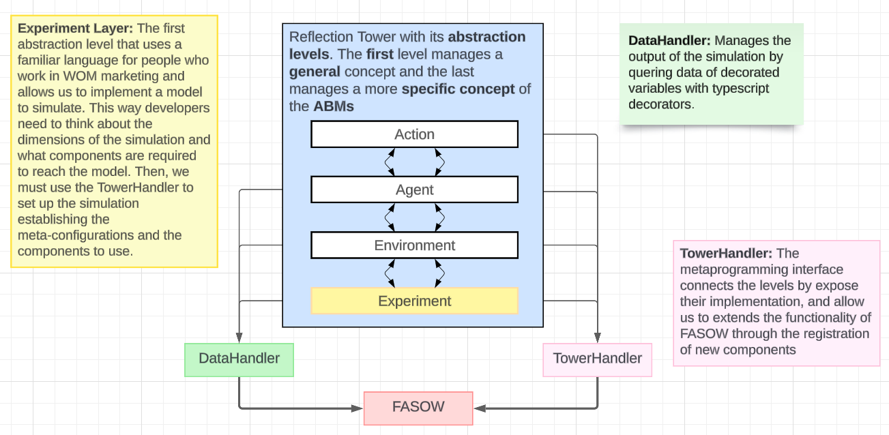
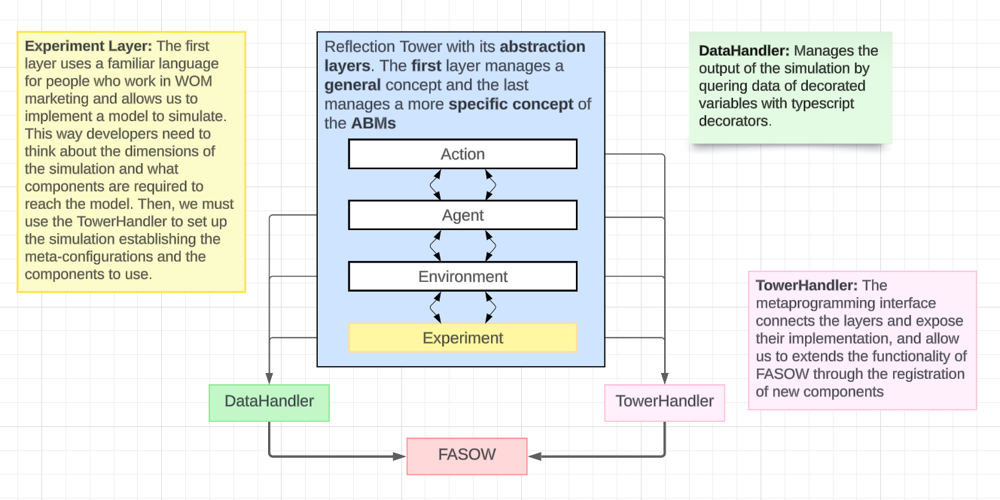

# FASOW

FASOW is a project that contains two subprojects: `fasow-api` and `fasow-monorepo`. This repository includes both the new version of the FASOW library, exposed as an HTTP API, and the legacy library along with its client for interacting with experiments.
## Table of Contents

- [Description](#description)
- [Project Structure](#project-structure)
- [Installation & Usage](#installation)
- [FASOW Basics: Architecture Design](#fasow-architecture)
- [License](#license)

## Description

The FASOW project is divided into two main parts:

1. **fasow-api:** This folder contains the new version of the FASOW library, which has been refactored and exposed as an HTTP API. This allows the experiments and functionalities of the library to be accessed through HTTP requests.

2. **fasow-monorepo:** This subproject includes the legacy version of the FASOW library along with a client that provides the necessary interface to interact with the experiments. It is useful for maintaining compatibility with previous versions and for users who still rely on the legacy implementation. **The `fasow-monorepo` was developed with Node.js 16 and has been run with Node.js 22, but we are not sure of its correct execution.**

## Project Structure

```plaintext
FASOW/
│
├── fasow-api/                    # New version of the FASOW library exposed as an HTTP API
│   ├── .eslintrc.js              # ESLint configuration
│   ├── .prettierrc               # Prettier configuration
│   ├── fasowLoader.ts            # Main loader script that allows users to register new clases for FASOW
│   ├── nest-cli.json             # NestJS CLI configuration
│   ├── package.json              # Project dependencies and scripts
│   ├── README.md                 # Documentation specific to fasow-api
│   ├── tsconfig.build.json       # TypeScript configuration for build
│   ├── tsconfig.json             # General TypeScript configuration
│   └── src/                      # Source code for the API
│
└── fasow-monorepo/               # Legacy library and client for experiments
    ├── packages/                 # Packages and modules of the legacy library
    ├── .gitignore                # Git ignore file for unnecessary files
    ├── FASOWState.json           # State file for the legacy library
    ├── lerna.json                # Lerna configuration for the monorepo
    ├── LICENSE                   # Project license
    ├── package.json              # Dependencies and scripts for the monorepo
    ├── README.md                 # Documentation specific to fasow-monorepo
    └── yarn.lock                 # Dependency lock file for Yarn
```

## Installation

To clone the project and access its subprojects, follow these steps:

```bash
git clone https://github.com/pragmaticslaboratory/fasow.git
cd fasow
```

### Installing & Running fasow-api

```bash
cd fasow-api
npm install
npm run start:dev
```

### Installing & Running fasow-monorepo

```bash
cd fasow-monorepo
yarn install
yarn start
```

# FASOW Architecture

The FASOW architecture is based on the idea of the reflection tower, and is composed by 
3 principal modules, the `Experiment`, the `TowerHandler` and the `DataHandler`. Thus, FASOW provides us
A way to implement and create a simulation of an Agent Based model of a Word of Mouth campaign on a Social
Network Site (SNS), managing a flexible architecture easy to learn (easy to reach more users?) and an output generator.


# DataHandler
# TowerHandler

## Reflective Tower 

The idea of the reflection tower is present in programming languages and allow us to segment a 
software architecture by abstraction levels of different granularity. On this case, the FASOW architecture
is segmented by 4 layers (Experiment, Environment, Agent and Actions), where each one handles a specific concern of
the Agent Based Models.

### FASOW Levels

A level in FASOW is an abstraction that handles a specific concern of the ABMs and is composed principally
by three modules or more.


* MetaLevel Interface: A Metaprogramming interface that exposes the functionality of the implementation of the base interface
  and had the capability to register and manage the new particularities for the level by his instantiation on the execution time. 

* MetaLevel Config: Is a Meta-Configuration object which communicate and connect the MetaLevel Interface with the BaseLevel Interface, 
  with this configuration and with the Meta Level Interface we can indicate and manage how to the instantiation of the particularities 
  will be handled in the execution time.

* BaseLevel Interface: A Base Interface, that can be abstract or not, but that defines the base functionality for the level, 
  this interface is the entity that the MetaLevel Interface will  instantiate on execution time.

* ParticularityLevel Modules: These modules are entities that extends the functionality that provides the base level interface, 
  and allows to users to implements other requirements that cant be provided by the base level interface.

by this way, and by adding levels with less particularity knowledge we can start to see the Reflection Tower!
which connect and centralize all MetaInterfaces on the TowerHandler.


### 1.Experiment Level

The experiment level manage the `experiments` on FASOW, and represents the model to study, implement and simulate, 
this level is composed by the `ExperimentAPI`, the `MetaExperimentConfig` and the Abstract `Experiment` class 
with his extended particularities modules.

The `Experiments` allow us to introduce the input the model and define strategy to follow during the simulation
on FASOW, however, to do that as previous step we need to register all modules that will being used on the simulation by using the use of the TowerHandle.
```typescript

abstract class Experiment {
  name: string;
  description: string;
  repetition: number;
  maxRepetitions: number;
  
  strategy(): void;
  run();
  setConfig(config: MetaExperimentConfig): void;
  loadConfig(): void;
  //..getters and setters 
}
```
The `ExperimentAPI` manages the `Experiments` by handling his registration and creation, also allow us to set and change 
the configuration on the MetaExperimentConfig, which represents part of the information required to instantiate and 
initialize the model to run the simulation.
```typescript

interface IExperimentAPI {
  selectExperimentByName(experiment: string): void;
  registerNewExperiment(exp: typeof Experiment): void;
  setExperimentName(name: string): void;
  setExperimentDescription(description: string): void;
  setExperimentMaxRepetitions(maxRepetitions: number): void;
  getExperimentConfig(): MetaExperimentConfig;
  createSelectedExperiment(): Experiment;
  selectExperiment(selected: typeof Experiment): void;
  getSelectedExperiment(): typeof Experiment;
  getState(): any;
  selectExperimentByName(experiment: string): void;
}
```

The `MetaExperimentConfig` help us to define a name, a description and what to instantiate for the experiment
to simulate, and  also, we can define a number of times which the simulation will be repeated to handles the
stochastic effect.

```typescript
export default interface MetaExperimentConfig {
  // Experiment Metadata
  readonly id: number;
  name: string;
  description: string;
  type: typeof Experiment;
  maxRepetitions: number;
  // Scenario Metadata
  environmentConfig: MetaEnvironmentConfig;
}
```

### 2. Environment Level

The environment level manages the `Environments` which are the abstraction of a Social Network Site (SNS) and the simulation,
allow us to define and configure the Simulation. This level is composed by the `EnvironmentAPI`, the `MetaEnvironmentConfig`
and the Abstract `Environment`.

The `Environments` being the abstraction of the simulation and a Social Network Site, enable us to set the size of the
simulation, the types of Agents to create and his relationships, and the duration of a simulation. Also, provides
the place to define the behavior that a social network site and his users will follow.

```typescript
export default abstract class Environment implements EnvironmentConfig, IEnvironmentCreator, Ticks {
  id: number;
  initialized: boolean;
  seedSize: number;
  networkSize: number;
  seeds: Agent[];
  agents: Agent[];
  maxTick: number;
  tick: number;
  
  setConfig(config: MetaEnvironmentConfig): Environment;
  public abstract step(): void;
  public run(): void;
  initialize(): void;
  createAgents(): void;
  addFollowers(): void;
  addFollowings(): void;
  isDone(): boolean;
  resetAgentStates(): void;
  resetSeedStates(): void;
  abstract createEnvironment(environmentConfig: MetaEnvironmentConfig): Environment;
  //...getters and setters
}
```
The `MetaEnvironmentConfig` establish the configuration of the simulation like the size of agents to create, the duration 
of the simulation, the SNS to use and the configuration of the agents to instantiate.

```typescript
export default interface MetaEnvironmentConfig {
  networkSize: number;
  maxTick: number;
  environmentType: typeof Environment;
  metaAgentsConfigs: MetaAgentConfig[];
}
```

The `MetaEnvironmentAPI` manages the registration of the new Environments particularities and the configuration of the
Environment that will be created on the execution time.

```typescript
export default interface EnvironmentAPI {
  //...
  registerNewEnvironment(newEnvironmentType: typeof Environment)
  private getEnvironment(environmentType: typeof Environment): typeof Environment //Why is private ?
  generateEnvironment(config: MetaEnvironmentConfig): Environment
  setNetworkToScenario(environment: typeof Environment)
  addAgentToScenario(agentConfig: MetaAgentConfig)
  setNetworkSizeToScenario(size: number)
  setPeriodsToScenario(max: number)
  setScenarioConfig(scenarioConfig: MetaEnvironmentConfig)
  getScenarioConfig(): MetaEnvironmentConfig
  resetScenarioConfig(): MetaEnvironmentConfig
  getState(): any
}
```

### 3. Agent Level

The experiment layer manage the `experiments`

```typescript
console.log('Hola mundo')
```
### 4. Action Level

The experiment layer manage the `experiments`

```typescript
console.log('Hola mundo')
```

## The FASOW Tower



## FASOW Modules
### DataHandler Decorators 

## Social Network Sites.
## Extending Behaviors

With the use of the Reflection Tower and with the Four Levels of abstraction that provides FASOW
we can extend the functionality of FASOW by the creation of:

1. **New Experiments**: To Implement a new Model to simulate on FASOW!.
2. **New Environments**: To Adding new Social Network Sites (like the Reddit Social Network) or a specific Agent management rule.
3. **New Agents**: To Adding new behaviors, logic or states that could have an Agent.
4. **New Actions**: To Adding new ways to send or receive a message or change the state of the agent in some circumstance.

Whichever will be the approach to follow, always we will have to Register this new Behavior on FASOW with the use of the TowerHandler.
```typescript
//..experiments/ExampleExperiment.ts
class ExampleExperiment extends Experiment {
  // ... other logic
  Strategy(): void {
    FASOW.TowerHandler.registerNewAgent(TwitterAgent); //Registering a new Agent on FASOW
    FASOW.TowerHandler.registerNewAction(ActionRead); //Registering a new Action on FASOW
    FASOW.TowerHandler.registerNewAction(ActionShare); //Registering a new Action on FASOW
    FASOW.TowerHandler.registerNewEnvironment(EnvironmentTwitter); // Registering a new Action on FASOW
  }
}
```

However, the `Experiments` must be Registered on FASOW, by importing them manually and adding to the `fasowLoader.ts` file
as the following way:

```typescript
//..fasowLoader.ts
import ExperimentAgentCombination from 'src/experiments/ExperimentAgentCombinatio/ExperimentAgentCombination';
import ExperimentAgentCombinationBestSeed from 'src/experiments/ExperimentAgentCombinatio/ExperimentAgentCombinationBestSeed';
import ExampleExperiment from './experiments/ExampleExperiment';
import TestExperiment from './experiments/TestExperiment/TestExperiment';

const fasowConfig = [
  ExperimentAgentCombination,
  ExperimentAgentCombinationBestSeed,
  ExampleExperiment,
  /** Add your Experiments below to register them on FASOW**/
  TestExperiment, //Here you are registering your Experiments
];

export default fasowConfig;
```

### Extending Experiment Layer.
### Extending Agent Layer.
### Extending Environment Layer.

### Extending Action Layer.
By extending the funtionality of the action layers we can add new behaviors to handle how to send, receive
the message or change some state in the Agents by the execution of some rules. 

To do this we need to create a new `Action` that extends the `Abstract Action` like this:
```typescript
class TestAction extends Action {
  createAction(actionData: MetaActionConfig): Action {
    return new TestAction().setConfig(actionData);
  }

  execute(agent: Agent): void {
    agent.receiveMessage();
    console.log('TestAction specialized Behavior');
  }
}
```
Then we need to register this new action with the TowerHandler to allow to FASOW can use them.

```typescript
// TODO: Imports must be fixed because FASOW not exists in that path xd
import FASOW from "./FASOW";
```
Also, to maintain the FASOW logic this must be done in definition of the Strategies on the Experiments.

```typescript
import FASOW from "./FASOW";
import Experiment from "./Experiment";


class ExampleExperiment extends Experiment {
  // ... other logic
  Strategy(): void {
    FASOW.TowerHandler.registerNewAction(TestAction); // Register the new Action on the Experiment Strategy
  }
}
```


## License

This project is licensed under the MIT License. See the [LICENSE](LICENSE) file for more details.
