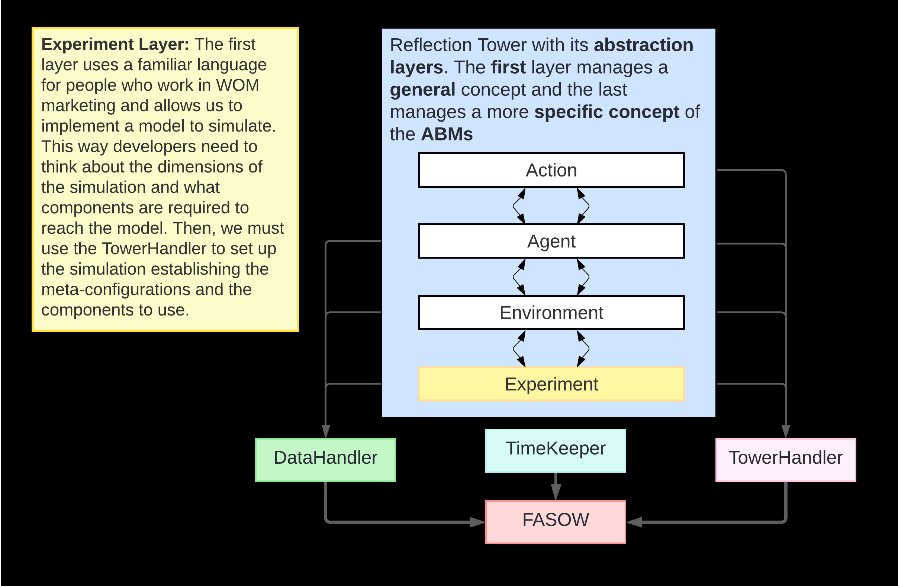

# FASOW

FASOW is a project that contains two subprojects: `fasow-api` and `fasow-monorepo`. This repository includes both the new version of the FASOW library, exposed as an HTTP API, and the legacy library along with its client for interacting with experiments.
## Table of Contents

- [Description](#description)
- [Project Structure](#project-structure)
- [Installation & Usage](#installation)
- [FASOW Basics: Architecture Design](#fasow-architecture)
- [License](#license)

## Description

The FASOW project is divided into two main parts:

1. **fasow-api:** This folder contains the new version of the FASOW library, which has been refactored and exposed as an HTTP API. This allows the experiments and functionalities of the library to be accessed through HTTP requests.

2. **fasow-monorepo:** This subproject includes the legacy version of the FASOW library along with a client that provides the necessary interface to interact with the experiments. It is useful for maintaining compatibility with previous versions and for users who still rely on the legacy implementation. **The `fasow-monorepo` was developed with Node.js 16 and has been run with Node.js 22, but we are not sure of its correct execution.**

## Project Structure

```plaintext
FASOW/
│
├── fasow-api/                    # New version of the FASOW library exposed as an HTTP API
│   ├── .eslintrc.js              # ESLint configuration
│   ├── .prettierrc               # Prettier configuration
│   ├── fasowLoader.ts            # Main loader script that allows users to register new clases for FASOW
│   ├── nest-cli.json             # NestJS CLI configuration
│   ├── package.json              # Project dependencies and scripts
│   ├── README.md                 # Documentation specific to fasow-api
│   ├── tsconfig.build.json       # TypeScript configuration for build
│   ├── tsconfig.json             # General TypeScript configuration
│   └── src/                      # Source code for the API
│
└── fasow-monorepo/               # Legacy library and client for experiments
    ├── packages/                 # Packages and modules of the legacy library
    ├── .gitignore                # Git ignore file for unnecessary files
    ├── FASOWState.json           # State file for the legacy library
    ├── lerna.json                # Lerna configuration for the monorepo
    ├── LICENSE                   # Project license
    ├── package.json              # Dependencies and scripts for the monorepo
    ├── README.md                 # Documentation specific to fasow-monorepo
    └── yarn.lock                 # Dependency lock file for Yarn
```

## Installation

To clone the project and access its subprojects, follow these steps:

```bash
git clone https://github.com/pragmaticslaboratory/fasow.git
cd fasow
```

### Installing & Running fasow-api

```bash
cd fasow-api
npm install
npm run start:dev
```

### Installing & Running fasow-monorepo

```bash
cd fasow-monorepo
yarn install
yarn start
```

# FASOW Architecture



## Reflextion Tower 

The idea of the reflection tower is present in programming languages and allow us to segment a 
software architecture by abstraction layers of different granularity. On this case, the FASOW architecture
is segmented by 4 layers (Experiment, Environment, Agent and Actions), where each one handles a specific concept of
the Agent Based Models.

### 1.Experiment Layer

The experiment layer manage the `experiments` 

```typescript
console.log('Hola mundo')
```

### 2. Environment Layer
### 3. Agent Layer
### 4. Action Layer

## FASOW Modules
### DataHandler Decorators 


## License

This project is licensed under the MIT License. See the [LICENSE](LICENSE) file for more details.
