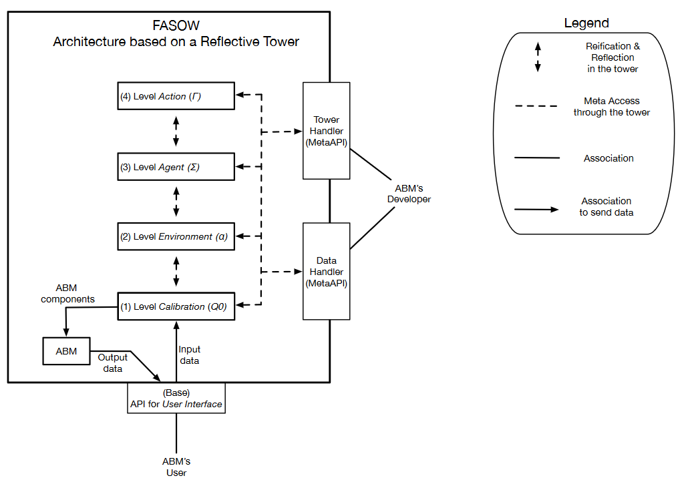
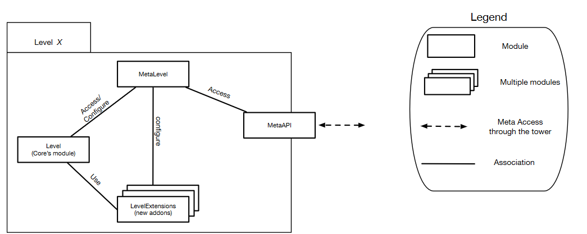
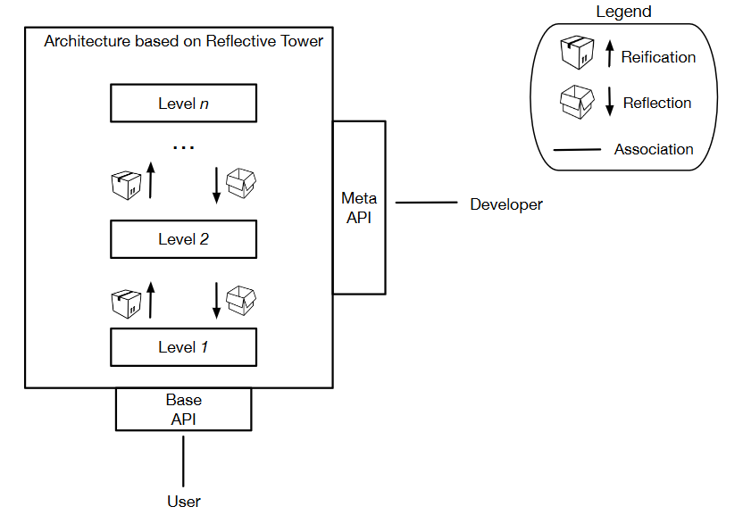
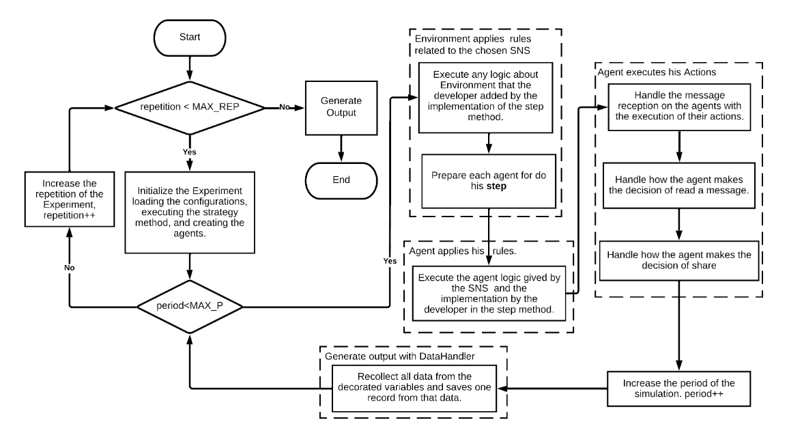

# Fasow

Fasow is a project that contains two subprojects: `fasow-api` and `fasow-monorepo`. This repository includes both the new version of the Fasow library, exposed as an HTTP API, and the legacy library along with its client for interacting with experiments.
## Table of Contents

- [Description](#description)
- [Project Structure](#project-structure)
- [Installation & Usage](#installation)
- [Fasow Basics: Architecture Design](#fasow-architecture)
- [License](#license)

## Description

The Fasow project is divided into three main parts:

1. **fasow-api:** This folder contains the new version of the Fasow library, which has been refactored and exposed as an HTTP API. This allows the experiments and functionalities of the library to be accessed through HTTP requests.

2. **fasow-monorepo:** This subproject includes the legacy version of the Fasow library along with a client that provides the necessary interface to interact with the experiments. It is useful for maintaining compatibility with previous versions and for users who still rely on the legacy implementation. **The `fasow-monorepo` was developed with Node.js 16 and has been run with Node.js 22, but we are not sure of its correct execution.**
   
3. **fasow-ui**: This folder contains the new version of the Fasow UI that works as console to select, initialize and run models implemented on Fasow.

## Project Structure

```plaintext
Fasow/
│
├── fasow-api/                    # New version of the Fasow library exposed as an HTTP API
│   ├── .eslintrc.js              # ESLint configuration
│   ├── .prettierrc               # Prettier configuration
│   ├── fasowLoader.ts            # Main loader script that allows users to register new clases for Fasow
│   ├── nest-cli.json             # NestJS CLI configuration
│   ├── package.json              # Project dependencies and scripts
│   ├── README.md                 # Documentation specific to fasow-api
│   ├── tsconfig.build.json       # TypeScript configuration for build
│   ├── tsconfig.json             # General TypeScript configuration
│   └── src/                      # Source code for the API
│
└── fasow-monorepo/               # Legacy library and client for experiments
    ├── packages/                 # Packages and modules of the legacy library
    ├── .gitignore                # Git ignore file for unnecessary files
    ├── FASOWState.json           # State file for the legacy library
    ├── lerna.json                # Lerna configuration for the monorepo
    ├── LICENSE                   # Project license
    ├── package.json              # Dependencies and scripts for the monorepo
    ├── README.md                 # Documentation specific to fasow-monorepo
    └── yarn.lock                 # Dependency lock file for Yarn
```

## Installation

To clone the project and access its subprojects, follow these steps:

```bash
git clone https://github.com/pragmaticslaboratory/fasow.git
cd modules
```

### Installing & Running fasow-api

```bash
cd modules-api
npm install
npm run start:dev
```

### Installing & Running fasow-monorepo

```bash
cd modules-monorepo
yarn install
yarn start
```

### Installing & Running fasow-ui

```bash
cd modules-ui
npm install
npm run dev
```

# Fasow Architecture

The Fasow architecture is based on the idea of the reflection tower, and is composed by 
3 principal modules, the `Experiment`, the `TowerHandler` and the `DataHandler`. Thus, Fasow provides us
a way to implement and create simulations of an Agent Based model of a Word of Mouth campaign on a Social
Network Site (SNS), managing a flexible architecture easy to learn (easy to reach more users?) and an output generator.


<p align="center">Fasow Architecture</p>

# Calibration

This experiment represent a selected Agent-Based model on Fasow where we can change them, by selecting other one, initialize them to prepare Fasow to start a simulation by instantiating the required entities on the model, running it by their execution and finally get the output of each iteration and repetition time of the simulation to get the result of the simulation.

// This both modules interact laterally with the Experiment by interacting with the selected experiment on execution time, the datahandler is notified by each time on the simulation of the selected model by the use of the observer pattern, and the TowerHandler using the idea of the reflection tower allows to instantiate the required extensions of the selected model.   

# DataHandler

The DataHandler modules uses the observer pattern that where agents, environments, and experiments notifies and updates the datahandler each time where a tick or a repetition happen. So the DataHandler, that had a list of the references of all the instances of the classes that had decorated his attributs with a DataHandler decorator like: 

<div style="max-height: 200px; overflow-y: auto;">

```typescript
//Todo: Agregar ejemplos de los diferentes decoradores de atributos que existen disponibles en modules.

/**
 * For each tick of the clock, it counts all the agents that have the decorated property,
 * to later display it in the output on the column with name @name. Users could count
 * false or true values according to the value of countFalse.
 *
 * @param name : string : The column name of the property being registered
 * @param countFalse : boolean : specify if the count was being to true or false values.
 *    If countFalse = true, agents with a false value will be counted
 *    If countFalse = false, agents with a true value will be counted
 */
export function AgentCountBoolean(name: string, countFalse: boolean);

/**
 * For each period, it counts all the agents whose agent.state is equal to the
 * value entered and then displays a column with the name @name in the output.
 *
 * @param name : string : The column name of the property being registered
 * @param value : number : The value that is registered as possible agent status and that will be used
 * to count the agents that have this value as status.
 */
export function AgentStateIntegerCount(name: string, value: number);

/**
 * For each period, add the values of each agent that have this property, to then display a column named @name in the output.
 * @param name : string : The column name of the property being registered.
 */
export function AccumulateAgentValue(name: string);

/**
 * For each period, it adds the old values with the current value of the property for the corresponding period, to then display a column named @name in the output.
 * @param name : string : The column name of the property being registered.
 */
export function AccumulateEnvironmentValue(name: string);

/**
 * For each period it records the marked parameter, and then it is recorded in the output in a column named @name
 * @param name : string : The column name of the property being registered.
 */
export function EnvironmentCount(name: string);

/**
 * For each repetition it records the marked parameter, and then it is recorded in the output in a column named @name
 * @param name : string : The column name of the property being registered.
 */
export function ExperimentCount(name: string);
```
</div>

# TowerHandler

The TowerHandler is a module that allows us to encapsulate and expose the implementation of certain ABMs concerns of Fasow,
In this way, we can handle and manage how a class will be instantiated on execution time.

### Fasow Levels

A level in Fasow is an abstraction that handles a specific concern of the ABMs and is composed principally
by three modules and extensions modules.


<p align="center">Fasow Level X</p>

* `MetaAPI`: A Metaprogramming API that exposes the implementation of the Level interface. The MetaLevel API
  provides methods to managed, define or interact with the instantiation of the particularities of the level on execution time, and provides
  the capability to register new extensions for the level. 

* `MetaLevel`: Is a Configuration object which communicate and connect the MetaLevelAPI with the Level Interface.
  This objects had certain information that is required to pass through the Level constructor when we will instantiate them
  on execution time.

* `LevelCore Module`: The core module of the level, that can be abstract or not, but that defines the base functionality for the level, 
  this interface is the entity that the MetaLevel Interface will instantiate on execution time.

* `Level Extensions` Level Modules: These modules are entities that extends the functionality that provides the level interface, 
  and allows to users to implements other requirements that cant be provided by the base level interface.

We created fourth fasow levels where each level had less particularity knowledge of the abm concern (or model?), 
these levels were injecting on the TowerHandler, to facade theirs implementations and centralize the concerns in one class
by this wey we can start to see the `Reflective Tower`.

#### Reflective Tower

The `Reflective Tower` Is based on the idea of the reflection tower that is present in programming languages and allow us to segment a
software architecture by abstraction levels of different granularity. On this case, the Fasow architecture
is segmented by 4 levels (Calibration, Environment, Agent and Actions), where each one handles a specific concern of
the Agent Based Models.


<p align="center">Reflective Tower</p>

### 1. Calibration Level

The Calibration level manage the `experiments` on Fasow, that represents a model to study, implement and simulate. The level
is composed by the `ExperimentAPI`, the `MetaExperimentConfig` and the Abstract `Experiment` class with his extended particularities modules.

The `Experiments` allow us to introduce the input of the model and define a strategy to follow during the simulation, but,
before, we need to register all the modules that will require on the simulation by the use of the TowerHandle.

```typescript

abstract class Experiment {
  name: string;
  description: string;
  repetition: number;
  maxRepetitions: number;
  
  strategy(): void;
  run();
  setConfig(config: MetaExperimentConfig): void;
  loadConfig(): void;
  //..getters and setters 
}
```


The `CalibrationAPI` allow us to register, manage and instantiate `Experiments` , also allow us to set and change 
the configuration on the MetaExperimentConfig, which represents part of the information required to instantiate and 
initialize the model to run the simulation.
```typescript

interface CalibrationAPI {
  selectExperimentByName(experiment: string): void;
  registerNewExperiment(exp: typeof Experiment): void;
  setExperimentName(name: string): void;
  setExperimentDescription(description: string): void;
  setExperimentMaxRepetitions(maxRepetitions: number): void;
  getExperimentConfig(): MetaExperimentConfig;
  createSelectedExperiment(): Experiment;
  selectExperiment(selected: typeof Experiment): void;
  getSelectedExperiment(): typeof Experiment;
  getState(): any;
  selectExperimentByName(experiment: string): void;
}
```

The `MetaCalibration` help us to define a name, a description and what to instantiate for the experiment
to simulate, and  also, we can define a number of times which the simulation will be repeated to handles the
stochastic effect.

```typescript
export default interface MetaCalibration {
  // Calibration Metadata
  readonly id: number;
  name: string;
  description: string;
  type: typeof Experiment;
  maxRepetitions: number;
  // Scenario Metadata
  environmentConfig: MetaEnvironmentConfig;
}
```

### 2. Environment Level

The environment level manages the `Environments` which are the abstraction of a Social Network Site (SNS) and the simulation.
An environment allow us to define and configure a simulation on Fasow. This level is composed by the `EnvironmentAPI`, the `MetaEnvironment`
and the Abstract `Environment`.

The `Environments` being the abstraction of the simulation and a Social Network Site, enable us to set the size of the
simulation, the types of Agents to create and his relationships, and the duration of the simulation. Also, provides
a place to define the behavior of a social network site, his users, his followers and his followings. On the line of 
the WOM communication process on FASOW, we can have two types of agents, the seeds and the non-seeds, where a seed agent is
an agent that start the WOM communication process.

```typescript
export default abstract class Environment implements EnvironmentConfig, IEnvironmentCreator, Ticks {
  id: number;
  initialized: boolean;
  seedSize: number;
  networkSize: number;
  seeds: Agent[];
  agents: Agent[];
  maxTick: number;
  tick: number;
  
  setConfig(config: MetaEnvironmentConfig): Environment;
  public abstract step(): void;
  public run(): void;
  initialize(): void;
  createAgents(): void;
  addFollowers(): void;
  addFollowings(): void;
  isDone(): boolean;
  resetAgentStates(): void;
  resetSeedStates(): void;
  abstract createEnvironment(environmentConfig: MetaEnvironmentConfig): Environment;
  //...getters and setters
}
```
The `MetaEnvironment` establish the configuration of the simulation like the size of agents to create, the duration 
of the simulation, the SNS to use and the configuration of the agents to instantiate.

```typescript
export default interface MetaEnvironmentConfig {
  networkSize: number;
  maxTick: number;
  environmentType: typeof Environment;
  metaAgentsConfigs: MetaAgentConfig[];
}
```

The `EnvironmentAPI` manages the registration of the new Environments extensions and the configuration of the
Environment that will be instantiated on the execution time.

```typescript
export default interface EnvironmentAPI {
  //...
  registerNewEnvironment(newEnvironmentType: typeof Environment)
  private getEnvironment(environmentType: typeof Environment): typeof Environment //Why is private ?
  generateEnvironment(config: MetaEnvironmentConfig): Environment
  setNetworkToScenario(environment: typeof Environment)
  addAgentToScenario(agentConfig: MetaAgentConfig)
  setNetworkSizeToScenario(size: number)
  setPeriodsToScenario(max: number)
  setScenarioConfig(scenarioConfig: MetaEnvironmentConfig)
  getScenarioConfig(): MetaEnvironmentConfig
  resetScenarioConfig(): MetaEnvironmentConfig
  getState(): any
}
```

### 3. Agent Level
//Todo: Describe the level as a general way, then describe the Abstract Class, The MetaConfig, and the MetaAPI

The Agent level manage the `Agents` which are the abstraction of the users of a SNS, and allow us to create new
types of agents and defining specific behaviors that they can do on the simulation. Agents are connected with 
other Agents that they can follow, connect or subscribe to catch up some information that the other Agents
shares with his connections. By this way the Agent level is composed by `AgentAPI`, the `MetaAgent` and the `abstract Agent`

The `AgentAPI` manages the registration of the new Agent extensions, and the correct instantiation of the MetaAgent 

```typescript

export default class AgentAPI {
  private agentsFactories: Map<string, typeof Agent>;
  private agentConfigs: MetaAgentConfig[];
  
  registerNewAgent(type: typeof Agent);
  registerNewMetaAgentConfig(agentConfig: MetaAgentConfig);
  registerMetaConfigs(agentConfigs: MetaAgentConfig[]);
  generateAgentList(): Agent[];
  generateAgentsByConfigs(metaConfigs: MetaAgentConfig[]): Agent[];
  getMetaAgentConfigById(id: number);
  getState(): any;
}
```

`MetaAgent` had the information required to instantiate an Agent on execution time, so had their
name, the percentage of type of Agents to instantiate that compose the SNS, their initial state, their behavior 
and if these instances will seed or not.

```typescript
export default interface MetaAgent {
// Metadata
readonly id: number;
name: string;
percentage: number;
followersPercentage: number;
actionsConfigs: MetaAction[];
type: typeof Agent;
// Normal data to create a agentConfig ?
state?: AgentState;
isSeed: boolean;
}
```


The abstract `Agent` is the abstraction of a user of a SNS, can have followers and followings, creating connections
with other Agents, and making a subscription with these agents, being available to send and receive the messages that they publish on the Network.
Thus, way agents have states that are determined by some event, behavior o Action related with the Word of Mouth (WOM) communication process
where they can READ a message or SHARE a message, between others agents ... (Read more info in ``WOM Communication Process in Fasow``)


```typescript
export default abstract class Agent implements AgentConfig, IAgentCreator, Observer, Subject {
  id: number;
  state?: AgentState | undefined;
  isSeed: boolean;
  actions: Action[];
  followers: Agent[];
  followings: Agent[];
  indexMetaAgentConfig: number;
  
  abstract step(): void;
  addFollower(agent: Agent)
  addFollowing(agent: Agent)
  removeFollower(agentId: number)
  removeFollowing(agentId: number)
  receiveMessage(): void
  resetState(): void
  abstract createAgent(id: number, agentData: MetaAgentConfig): Agent;
  setConfig(id: number, config: MetaAgentConfig): Agent
  share(): void
  abstract update(message: any): any;
```

### 4. Action Level

The Action level manage the `Actions` , that are behaviors that the Agents do or not. 
Actions are fundamentals on the WOM Communication Process on Fasow, because they give us the capability to define behaviors,
that can modify the state of the agents. This level is composed by the `ActionAPI`, the `MetaAction` and the abstract `Action`

The `ActionAPI` manage the registration of the new Action extensions and the instantiation of the new Actions, 
and provides methods to manages the MetaActions.

```typescript

export default class ActionAPI {
  // private actionFactories: Map<typeof Action, IActionCreator>;
  private actionConfigs: MetaActionConfig[];
  // private actionFactories : typeof Action[];
  private actionFactories: Map<string, typeof Action>;

  registerNewAction(newActionType: typeof Action)
  registerMetaActionConfig(actionConfig: MetaActionConfig)
  private getAction(type: typeof Action): typeof Action
  generateActionList(): Action[]
  generateActions(metaConfigs: MetaActionConfig[]): Action[]
  getMetaConfigs(): MetaActionConfig[]
  getState(): any

```

the `MetaAction` allows to assign a probability to happen for an Action to instantiate and to identify them.

```typescript
export default interface MetaActionConfig {
  readonly id: number;
  name: string;
  probability: number;
  type: typeof Action;
}
```

The abstract Action is very simply and uses the inversion of control with the method execute, thus way
Actions receive the instance of the Agent that execute the action and can interact with the Agent. Also,
the Action is a representation of the command design pattern where the Agents are the Invokers and the Actions the function to execute!

```typescript
export default abstract class Action implements ActionConfig, IActionCreator {
  name: string;
  probability: number;
  idMetaActionConfig: number;
  
  abstract execute(agent: Agent): void;
  public getRandom(): number;
  public setConfig(actionConfig: MetaActionConfig): Action;
  abstract createAction(actionData: MetaActionConfig): Action;
  
}
```

## The Word of Mouth Communication Process in Fasow.

The WOM communication process in Fasow depends on the interacting of the different components of fasow and by two principally
types of iterations, the repetitions and the ticks. Where each one manages a different concept of the time.

- Repetitions: Allows us to avoid the stochastic effect by repeating a simulation over and over again to generate different and
  random outputs to then weighting and standardize them.

- Ticks: Represent a discrete unit of time like one day, one hour, one second, one week, but usually is one day.

### The Fasow Process


<p align="center">Word of mouth communication process on Fasow</p>

With the use of the interaction of the different extensions of fasow,
we can start to draw a basic flow for their WOM communication process,
because we define a path to get a message, thinking about them, make the decision to share, and share them with his subscribers.
As this way we created a method to handle what an agent can do before, during and after they communicate information.

However, we also need to know and understand how this process beginnings, so is:

1. Select an experiment and runit
2. Initialize the repetitions from zer (0)
3. Initialize the Calibration of the model by execute his strategy and start to instantiate the Environment, Agent and Action extensions.
4. Start to iterate through the repetition of the model to avoid the stochastic effect.
5. Start validation of a correct initialization of the simulation
6. Run a simulation to iterate through the ticks of the simulation to understand the past of the time 
7. Executes and applies the social network site logic and the seeds agents sends the first message. 
8. Executes and applies the user logic to prepare them to receive information.
9. Executes the Actions of the Agents by handling the reception of a message.
10. Agents takes the decision to read the message.
11. Agents takes the decision to share the message
12. DataHandler is notified of the end of the tick and next tick is assigned 
13. DataHandler query decorated variables and generate an iteration output row
14. DataHandler is notified of the end of the repetition, a new iteration output row is created and next repetition is assigned
15. DataHandler generates the output

<div style="max-height: 200px; overflow-y: auto;">

```

Experiment.Run()
initializeRepetitions()
Calibration.initialize():
Iteration type, Repetition:
  Simulation.isDone()?
  if !done:
    end repetitions;
  simulation.run():
  nextRepetition(): // repetitions+=1, and notifies data handler module to start querying the decorated variables.
  validateCanNextRepetition():
  initialize the Calibration model:

Calibration.initialize():
  
Simulation.isDone():
  is done is:
    the agents instances maintain the networkSize;
    the instances of seed maintain the seedSize;
    for each agent validate:
    followers or followings was mutated? from the percentage of the networkSize;

Simulation.run():
  this.environment.run():
    Environment.canNextTick(): //Tick iterations
      Environment.Step(): //And print step data
        Execute Environment extension.Step():
          Environment.agents.forEach(agent => agent.step())
            Agent.Step()
              Execute Agent extension.Step():
                Agent.forEach(action => action.execute())

EnvironmentExtension.Step():
  A way to define the sharing information process of the social network site, the 
  simples way to define this process is do:

step(): void {
  this.agents.forEach((agent) => {
    agent.step();
  });
}
Agent.Step():
this.agent.Actions.forEach((action) => {
  action.execute();
});
```

</div>

### Actions
We have two principal actions defined that are part of the WOM communication process of Fasow. The first is The READ action and the SHARE action,
that are logically the same, events that depends on the states of the agents, and a probability to happen or not. Thus, way we can define
different types of actions to create behaviors that adapts to our needs,  and modify our `Agents` and the `Environment`.

* `ActionRead`: Check the state of the agent that receives a message, and handles the switch of the state to `AgenState.READ` if the state of the agent is `AgenState.NOT_READ`

* `ActionShare`: Check the state of the agent that receives the message and if he had his state as `AgentState.READ`, indicates that the agent already has executed the `ActionRead`, and now we can handle how to send a message

<div style="max-height: 200px; overflow-y: auto;">

```typescript
/** Model/Action/WOM/ActionRead **/
export default class ActionRead extends Action {
  execute(agent: Agent): void {
    const aux: TwitterAgent = <TwitterAgent>agent;
    if (aux.state === AgentState.NOT_READ) {
      const p1: number = this.getRandom();
      if (p1 > 100 - this.probability) {
        aux.state = AgentState.READ;
      }
    }
  }
}
```
```typescript
/** Model/Action/WOM/ActionShare **/
export default class ActionShare extends Action {
  execute(agent: Agent): void {
    const aux: TwitterAgent = <TwitterAgent>agent;
    if (aux.state === AgentState.READ) {
      const p1: number = this.getRandom();
      if (p1 > 100 - this.probability) {
        aux.state = AgentState.READY_TO_SHARE;
      }
    }
  }
}
```
</div>

### AgentStates:
- NOT_READ: Indicates that the agent no have read some message and are be able to receive a message and read one.
- READ: Indicates that the agent already have read some message and that's it and now are be able to decide if SHARE or not with other the message.
- READY_TO_SHARE: Indicates that the Agent take the decision to share the message with their followers.
- SHARED: Indicates that the agent already shared a message with their followers.

```typescript
/**
 * Enumeration of the most simply states of an Agent in a WOM communication process.
 * NOT_READ = 0,
 * READ = 1,
 * READY_TO_SHARE = 2,
 * SHARED = 3
 */
export enum AgentState {
  NOT_READ,
  READ,
  READY_TO_SHARE,
  SHARED,
}
```

## Fasow Modules
### DataHandler Decorators 

## Social Network Sites.
## Extending Behaviors

With the use of the Reflection Tower and with the Four Levels of abstraction that provides Fasow
we can extend the functionality of Fasow by the creation of:

1. **New Experiments**: To Implement a new Model to simulate on Fasow!.
2. **New Environments**: To Adding new Social Network Sites (like the Reddit Social Network) or a specific Agent management rule.
3. **New Agents**: To Adding new behaviors, logic or states that could have an Agent.
4. **New Actions**: To Adding new ways to send or receive a message or change the state of the agent in some circumstance.

Whichever will be the approach to follow, always we will have to Register this new Behavior on Fasow with the use of the TowerHandler.
```typescript
//..experiments/ExampleExperiment.ts
class ExampleExperiment extends Experiment {
  // ... other logic
  Strategy(): void {
    Fasow.TowerHandler.registerNewAgent(TwitterAgent); //Registering a new Agent on Fasow
    Fasow.TowerHandler.registerNewAction(ActionRead); //Registering a new Action on Fasow
    Fasow.TowerHandler.registerNewAction(ActionShare); //Registering a new Action on Fasow
    Fasow.TowerHandler.registerNewEnvironment(EnvironmentTwitter); // Registering a new Action on Fasow
  }
}
```

However, the `Experiments` must be Registered on Fasow, by importing them manually and adding to the `fasowLoader.ts` file
as the following way:

```typescript
//..fasowLoader.ts
import ExperimentAgentCombination from 'src/experiments/ExperimentAgentCombinatio/ExperimentAgentCombination';
import ExperimentAgentCombinationBestSeed from 'src/experiments/ExperimentAgentCombinatio/ExperimentAgentCombinationBestSeed';
import ExampleExperiment from './experiments/ExampleExperiment';
import TestExperiment from './experiments/TestExperiment/TestExperiment';

const fasowConfig = [
  ExperimentAgentCombination,
  ExperimentAgentCombinationBestSeed,
  ExampleExperiment,
  /** Add your Experiments below to register them on Fasow**/
  TestExperiment, //Here you are registering your Experiments
];

export default fasowConfig;
```

### Extending The Experiment Level.
### Extending The Agent Level.
### Extending The Environment Level.

### Extending Action Layer.
By extending the funtionality of the action layers we can add new behaviors to handle how to send, receive
the message or change some state in the Agents by the execution of some rules. 

To do this we need to create a new `Action` that extends the `Abstract Action` like this:
```typescript
class TestAction extends Action {
  createAction(actionData: MetaActionConfig): Action {
    return new TestAction().setConfig(actionData);
  }

  execute(agent: Agent): void {
    agent.receiveMessage();
    console.log('TestAction specialized Behavior');
  }
}
```
Then we need to register this new action with the TowerHandler to allow to Fasow can use them.

```typescript
// TODO: Imports must be fixed because Fasow not exists in that path xd
import Fasow from "./Fasow";
```
Also, to maintain the Fasow logic this must be done in definition of the Strategies on the Experiments.

```typescript
import Fasow from "./Fasow";
import Experiment from "./Experiment";


class ExampleExperiment extends Experiment {
  // ... other logic
  Strategy(): void {
    Fasow.TowerHandler.registerNewAction(TestAction); // Register the new Action on the Experiment Strategy
  }
}
```


## License

This project is licensed under the MIT License. See the [LICENSE](LICENSE) file for more details.

