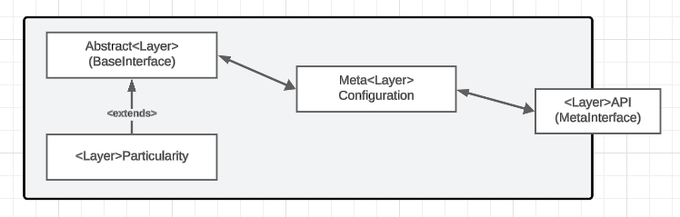
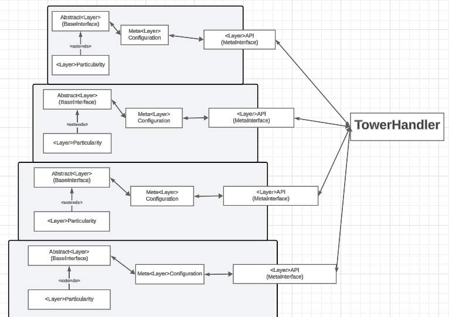

# FASOW

FASOW is a project that contains two subprojects: `fasow-api` and `fasow-monorepo`. This repository includes both the new version of the FASOW library, exposed as an HTTP API, and the legacy library along with its client for interacting with experiments.
## Table of Contents

- [Description](#description)
- [Project Structure](#project-structure)
- [Installation & Usage](#installation)
- [FASOW Basics: Architecture Design](#fasow-architecture)
- [License](#license)

## Description

The FASOW project is divided into two main parts:

1. **fasow-api:** This folder contains the new version of the FASOW library, which has been refactored and exposed as an HTTP API. This allows the experiments and functionalities of the library to be accessed through HTTP requests.

2. **fasow-monorepo:** This subproject includes the legacy version of the FASOW library along with a client that provides the necessary interface to interact with the experiments. It is useful for maintaining compatibility with previous versions and for users who still rely on the legacy implementation. **The `fasow-monorepo` was developed with Node.js 16 and has been run with Node.js 22, but we are not sure of its correct execution.**

## Project Structure

```plaintext
FASOW/
│
├── fasow-api/                    # New version of the FASOW library exposed as an HTTP API
│   ├── .eslintrc.js              # ESLint configuration
│   ├── .prettierrc               # Prettier configuration
│   ├── fasowLoader.ts            # Main loader script that allows users to register new clases for FASOW
│   ├── nest-cli.json             # NestJS CLI configuration
│   ├── package.json              # Project dependencies and scripts
│   ├── README.md                 # Documentation specific to fasow-api
│   ├── tsconfig.build.json       # TypeScript configuration for build
│   ├── tsconfig.json             # General TypeScript configuration
│   └── src/                      # Source code for the API
│
└── fasow-monorepo/               # Legacy library and client for experiments
    ├── packages/                 # Packages and modules of the legacy library
    ├── .gitignore                # Git ignore file for unnecessary files
    ├── FASOWState.json           # State file for the legacy library
    ├── lerna.json                # Lerna configuration for the monorepo
    ├── LICENSE                   # Project license
    ├── package.json              # Dependencies and scripts for the monorepo
    ├── README.md                 # Documentation specific to fasow-monorepo
    └── yarn.lock                 # Dependency lock file for Yarn
```

## Installation

To clone the project and access its subprojects, follow these steps:

```bash
git clone https://github.com/pragmaticslaboratory/fasow.git
cd fasow
```

### Installing & Running fasow-api

```bash
cd fasow-api
npm install
npm run start:dev
```

### Installing & Running fasow-monorepo

```bash
cd fasow-monorepo
yarn install
yarn start
```

# FASOW Architecture


//HOLA PROFE AUN TENGO QUE EDITAR ESTA FOTO YA QUE EL TIME KEEPER ESTA DENTRO DE EXPERIMENT Y ENVIRONMENT XD


## Reflextion Tower 

The idea of the reflection tower is present in programming languages and allow us to segment a 
software architecture by abstraction layers of different granularity. On this case, the FASOW architecture
is segmented by 4 layers (Experiment, Environment, Agent and Actions), where each one handles a specific concept of
the Agent Based Models.

### FASOW Levels/Layers

A level in FASOW is an abstraction Layer that handles a specific concept of the ABMs and is composed principally
by three modules or more.



* MetaLevel Interface: The MetaInterface that exposes the implementation of the ABM concept.
* MetaLevel Config: The MetaConfig Object which is a communication object that connect the MetaLevelAPI with the BaseLevelAPI
* BaseLevel Interface: The Abstract BaseInterface which had all the logic related with the ABM concept.
* ParticularityLevel Modules: And **N** particularities modules which add more functionality to FASOW
and extends the BaseLevel Interface.

by this way, and by adding levels with less particularity knowledge we can start to see the Reflection Tower!
which connect and centralize all MetaInterfaces on the TowerHandler.



### 1.Experiment Layer

The experiment layer manage the `experiments` 

```typescript
console.log('Hola mundo')
```

### 2. Environment Layer
### 3. Agent Layer
### 4. Action Layer

## FASOW Modules
### DataHandler Decorators 

## Social Network Sites.
## Extending Behaviors

With the use of the Reflection Tower and with the Four Levels of abstraction that provides FASOW
we can extend the functionality of FASOW by the creation of:

1. **New Experiments**: To Implement a new Model to simulate on FASOW!.
2. **New Environments**: To Adding new Social Network Sites (like the Reddit Social Network) or a specific Agent management rule.
3. **New Agents**: To Adding new behaviors, logic or states that could have an Agent.
4. **New Actions**: To Adding new ways to send or receive a message or change the state of the agent in some circumstance.

Whichever will be the approach to follow, always we will have to Register this new Behavior on FASOW with the use of the TowerHandler.
```typescript
//..experiments/ExampleExperiment.ts
class ExampleExperiment extends Experiment {
  // ... other logic
  Strategy(): void {
    FASOW.TowerHandler.registerNewAgent(TwitterAgent); //Registering a new Agent on FASOW
    FASOW.TowerHandler.registerNewAction(ActionRead); //Registering a new Action on FASOW
    FASOW.TowerHandler.registerNewAction(ActionShare); //Registering a new Action on FASOW
    FASOW.TowerHandler.registerNewEnvironment(EnvironmentTwitter); // Registering a new Action on FASOW
  }
}
```

However, the `Experiments` must be Registered on FASOW, by importing them manually and adding to the `fasowLoader.ts` file
as the following way:

```typescript
//..fasowLoader.ts
import ExperimentAgentCombination from 'src/experiments/ExperimentAgentCombinatio/ExperimentAgentCombination';
import ExperimentAgentCombinationBestSeed from 'src/experiments/ExperimentAgentCombinatio/ExperimentAgentCombinationBestSeed';
import ExampleExperiment from './experiments/ExampleExperiment';
import TestExperiment from './experiments/TestExperiment/TestExperiment';

const fasowConfig = [
  ExperimentAgentCombination,
  ExperimentAgentCombinationBestSeed,
  ExampleExperiment,
  /** Add your Experiments below to register them on FASOW**/
  TestExperiment, //Here you are registering your Experiments
];

export default fasowConfig;
```

### Extending Experiment Layer.
### Extending Agent Layer.
### Extending Environment Layer.

### Extending Action Layer.
By extending the funtionality of the action layers we can add new behaviors to handle how to send, receive
the message or change some state in the Agents by the execution of some rules. 

To do this we need to create a new `Action` that extends the `Abstract Action` like this:
```typescript
class TestAction extends Action {
  createAction(actionData: MetaActionConfig): Action {
    return new TestAction().setConfig(actionData);
  }

  execute(agent: Agent): void {
    agent.receiveMessage();
    console.log('TestAction specialized Behavior');
  }
}
```
Then we need to register this new action with the TowerHandler to allow to FASOW can use them.

```typescript
// TODO: Imports must be fixed because FASOW not exists in that path xd
import FASOW from "./FASOW";
```
Also, to maintain the FASOW logic this must be done in definition of the Strategies on the Experiments.

```typescript
import FASOW from "./FASOW";
import Experiment from "./Experiment";


class ExampleExperiment extends Experiment {
  // ... other logic
  Strategy(): void {
    FASOW.TowerHandler.registerNewAction(TestAction); // Register the new Action on the Experiment Strategy
  }
}
```


## License

This project is licensed under the MIT License. See the [LICENSE](LICENSE) file for more details.
