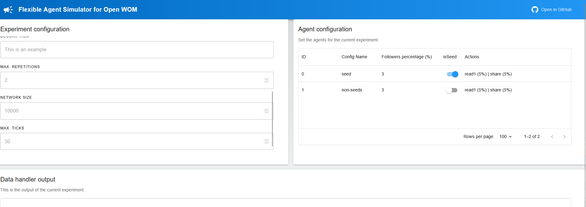
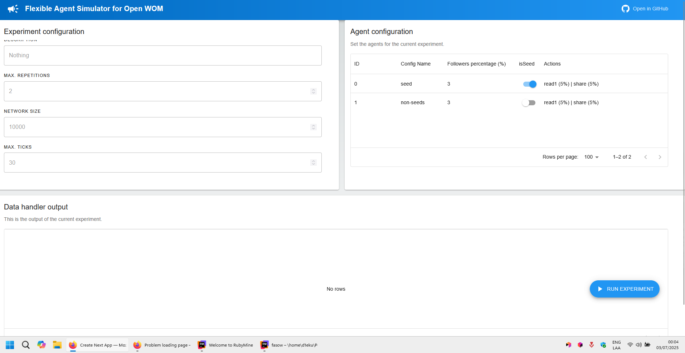

# Fasow

Fasow consists of three distinct projects. The `fasow-api` provides a backend implementation exposing Fasow functionality through HTTP endpoints. The `fasow-ui` offers a frontend application built with modern web technologies that consumes the fasow-api services. The `fasow-monorepo` was the original project containing both the Fasow library and its client, which has now been strategically divided into the separate api and ui components to enable more agile, modular development.


## Table of Contents

- [Description](#description)
- [Project Structure](#project-structure)
- [Installation & Usage](#installation)
- [Fasow Basics: Architecture Design](#fasow-architecture)
- [License](#license)

## Description

The Fasow project is divided into three main parts:

1. **fasow-api:** This folder contains the new version of the Fasow library, which has been refactored and exposed as an HTTP API. This allows the experiments and functionalities of the library to be accessed through HTTP requests. Was developed with NestJs.
2. **fasow-ui**: This folder contains the new version of the Fasow UI that works as console to select, initialize and run models implemented on Fasow.
3. **fasow-monorepo:** This subproject includes the legacy version of the Fasow library along with a client that provides the necessary interface to interact with the experiments. It is useful for maintaining compatibility with previous versions and for users who still rely on the legacy implementation. **The `fasow-monorepo` was developed with Node.js 16 and has been run with Node.js 22, but we are not sure of its correct execution.**
   

## Project Structure

```plaintext
Fasow/
│
├── fasow-api/                    # New version of the Fasow library exposed as an HTTP API
│   ├── .eslintrc.js              # ESLint configuration
│   ├── .prettierrc               # Prettier configuration
│   ├── fasowLoader.ts            # Main loader script that allows users to register new clases for Fasow
│   ├── nest-cli.json             # NestJS CLI configuration
│   ├── package.json              # Project dependencies and scripts
│   ├── README.md                 # Documentation specific to fasow-api
│   ├── tsconfig.build.json       # TypeScript configuration for build
│   ├── tsconfig.json             # General TypeScript configuration
│   └── src/                      # Source code for the API
│
├── fasow-ui/
│    │
│    ├── src/                         # Source code directory
│    │   └── app/                     # Main application directory
│    │       ├── components/          # UI components
│    │       │   ├── HomeBox/         # Home component
│    │       │   ├── NavBar.tsx       # Navigation bar component
│    │       │   ├── Console.tsx      # Console interface component
│    │       │   ├── NewAgentModal/   # Modal for creating new agents
│    │       │   ├── AgentConfigurationBox/  # Agent configuration component
│    │       │   ├── DataHandlerOutputBox.tsx  # Output display component
│    │       │   └── ExperimentConfigurationBox/  # Experiment configuration component
│    │       │
│    │       ├── hooks/               # React hooks
│    │       ├── page.tsx             # Main page component
│    │       ├── layout.tsx           # Application layout
│    │       ├── favicon.ico          # Website favicon
│    │       └── globals.css          # Global CSS styles
│    │
│    ├── public/                      # Public assets directory
│    ├── middleware/                  # Middleware for the application
│    │
│    ├── package.json                 # Project dependencies and scripts
│    ├── tsconfig.json                # TypeScript configuration
│    ├── next.config.mjs              # Next.js configuration
│    ├── postcss.config.mjs           # PostCSS configuration
│    ├── tailwind.config.ts           # Tailwind CSS configuration
│    └── README.md                    # Documentation specific to fasow-ui
│
├── fasow-monorepo/               # Legacy library and client for experiments
├── package.json
└── deploy.js

```

## Installation

To clone the project and access its subprojects, follow these steps:

```bash
git clone https://github.com/pragmaticslaboratory/fasow.git
cd fasow
```

## Getting Started

To run the project:

1. Install dependencies for both the API and UI:
   ```
   cd fasow-api && npm install
   cd ../fasow-ui && npm install
   ```

2. Return to the root directory and start the project:
   ```
   cd ..
   npm run start
   ```

This will launch both the fasow-api backend and fasow-ui frontend applications using the deployment script in the root package.json.

### FASOW Word of Mouth communication process 

Fasow is a framework designed to simulate Word-of-Mouth (WOM) communication processes within social networks sites. To understand how to use it effectively, we'll start with a common scenario:

We want to create different types of seed users who will share a specific message and propagate it through a Social Network Service (SNS). For this example, we'll focus on X.com (formerly Twitter).

In this simulation, we need users who can:
1. Receive a message
2. Make a decision whether to read the message
3. If they read it, decide whether to share it with their followers or subscribers

The simulation models a Twitter-like environment where one user sends a message to another. The receiving user has two key decision points:
- Whether to read the received message
- If they read it, whether to share it with one or more of their followers

Each user decision occurs at discrete time steps, representing moments when users interact with the platform.

As users make decisions over time, they acquire different states associated with those moments (such as "not read," "read," "ready to share," or "shared").

To create this simulation, we'll define an experiment in Fasow that models this behavior.
### Why Fasow Uses This Approach

   Fasow simulations operate on two primary time concepts:

   - **Repetitions**: Multiple runs of the same simulation with random elements to produce statistically meaningful results by avoiding stochastic effects
   - **Ticks**: Discrete time units that represent the passing of time (e.g., days, hours, or minutes)

   The Word-of-Mouth process in Fasow follows a specific flow:
      1. A seed user initiates by sharing a message
      2. Other users receive the message
      3. Users decide whether to read the message (based on probability)
      4. Users who read decide whether to share (based on probability)
      5. The cycle continues as more users receive the message

   This approach allows us to model how information spreads through networks realistically, capturing the probabilistic nature of human behavior in social media.


## Creating Your First Simulation

To implement this scenario, we'll create a calibration model in Fasow that defines:
- The types of agents (users) in our network
- Their behaviors (reading and sharing)
- The environment (Twitter-like network)
- The simulation parameters (network size, duration, etc.)

Let's walk through the steps to create this simulation from scratch.

### 1. Create a Calibration

```typescript tsx
import FASOW from '../fasow';
import Experiment from '../fasow/fasow/abm/Experiment';
import ActionRead from '../fasow/fasow/abm/wom/custom-actions/ActionRead';
import ActionShare from '../fasow/fasow/abm/wom/custom-actions/ActionShare';
import EnvironmentTwitter from '../fasow/fasow/scenarios/twitter/EnvironmentTwitter';
import TwitterAgent from '../fasow/fasow/scenarios/twitter/TwitterAgent';
import { AgentState } from '../fasow/fasow/abm/interfaces/Agent/AgentState';

export default class ExampleExperiment extends Experiment {

    Strategy(): void {
    
    }
    createExperiment(): Experiment {
        return new ExampleExperiment();
    }
}

```

### 1.1 Registration of the classes that will being used.

```typescript tsx
import FASOW from '../fasow';
import Experiment from '../fasow/fasow/abm/Experiment';
import TwitterAgent from '../fasow/fasow/scenarios/twitter/TwitterAgent';
import ActionRead from '../fasow/fasow/abm/wom/custom-actions/ActionRead';
import ActionShare from '../fasow/fasow/abm/wom/custom-actions/ActionShare';

export default class ExampleExperiment extends Experiment {

    Strategy(): void {
        // Cargamos al agente que simula a un usuario de twitter
        FASOW.TowerHandler.registerNewAgent(TwitterAgent);
        //Cargamos las acciones que permiten leer y compartir
        FASOW.TowerHandler.registerNewAction(ActionRead);
        FASOW.TowerHandler.registerNewAction(ActionShare);
        //Cargamos el ambiente simulado de twitter
        FASOW.TowerHandler.registerNewEnvironment(EnvironmentTwitter);
    }
}
```

### 1.2 We configure the seed agents and non-seed agents using MetaAgentConfig
```typescript tsx
import FASOW from '../fasow';
import Experiment from '../fasow/fasow/abm/Experiment';
import TwitterAgent from '../fasow/fasow/scenarios/twitter/TwitterAgent';
import ActionRead from '../fasow/fasow/abm/wom/custom-actions/ActionRead';
import ActionShare from '../fasow/fasow/abm/wom/custom-actions/ActionShare';
import { AgentState } from '../fasow/fasow/abm/interfaces/Agent/AgentState';
import EnvironmentTwitter from '../fasow/fasow/scenarios/twitter/EnvironmentTwitter';


export default class ExampleExperiment extends Experiment {

    Strategy(): void {
        //...Loading of classes to use

        // Use the classes
        // The first configuration will be 
        // 5% of users in the network that will send a message to their followers

        const agent1 : MetaAgentConfig = {
            id: 0,
            name: 'seed',
            isSeed: true,
            state: AgentState.READY_TO_SHARE,
            type: TwitterAgent,
            percentage: 5,
            followersPercentage: 3,
            followingsPercentage: 0,
            actionsConfigs: [
                {
                    id: 0,
                    name: 'read1',
                    type: ActionRead,
                    probability: 5,
                },
                {
                    id: 1,
                    name: 'share',
                    type: ActionShare,
                    probability: 5,
                },
            ],
        };
        // Configuration for the remaining 95% of users who can receive messages from seed agents that they follow
        const agent2 : MetaAgentConfig = {
            id: 1,
            name: 'non-seeds',
            isSeed: false,
            state: AgentState.NOT_READ,
            type: TwitterAgent,
            percentage: 95,
            followingsPercentage: 3,
            followersPercentage: 3,
            actionsConfigs: [
                {
                    id: 0,
                    name: 'read1',
                    type: ActionRead,
                    probability: 5,
                },
                {
                    id: 1,
                    name: 'share',
                    type: ActionShare,
                    probability: 5,
                },
            ],
        };
    }
}
```
### 1.3 Setting the config of the scenario

```typescript jsx

import FASOW from '../fasow';
import Experiment from '../fasow/fasow/abm/Experiment';
import TwitterAgent from '../fasow/fasow/scenarios/twitter/TwitterAgent';
import ActionRead from '../fasow/fasow/abm/wom/custom-actions/ActionRead';
import ActionShare from '../fasow/fasow/abm/wom/custom-actions/ActionShare';
import { AgentState } from '../fasow/fasow/abm/interfaces/Agent/AgentState';
import EnvironmentTwitter from '../fasow/fasow/scenarios/twitter/EnvironmentTwitter';

export default class ExampleExperiment extends Experiment {
  Strategy(): void {
      //...Defined types of MetaAgentConfigs that allow to setup the network users  

      /*...Now we configure the scenario, defining the size of the network (quantity of agents to create),
        the iteration time, and the meta agent configs. 
      */
      FASOW.TowerHandler.setScenarioConfig({
      networkSize: 1000,
      maxTick: 10,
      environmentType: EnvironmentTwitter,
      metaAgentsConfigs: [agent1, agent2],
    });
  }
}


```

### 1.4 Finally adding the details of the Calibration

```typescript jsx
import FASOW from '../fasow';
import Experiment from '../fasow/fasow/abm/Experiment';
import TwitterAgent from '../fasow/fasow/scenarios/twitter/TwitterAgent';
import ActionRead from '../fasow/fasow/abm/wom/custom-actions/ActionRead';
import ActionShare from '../fasow/fasow/abm/wom/custom-actions/ActionShare';
import { AgentState } from '../fasow/fasow/abm/interfaces/Agent/AgentState';
import EnvironmentTwitter from '../fasow/fasow/scenarios/twitter/EnvironmentTwitter';

export default class ExampleExperiment extends Experiment { 
  Strategy(): void {
      // ... Loaded classes
      // ... Configured types of MetaAgentConfigs that allow setup of the network users
      // ... Defined scenario that sets the limits of the network, the configurations of the users and the duration of the simulation
      FASOW.TowerHandler.setExperimentName('Experiment-Example');
      FASOW.TowerHandler.setExperimentMaxRepetitions(2);
      FASOW.TowerHandler.setExperimentDescription('Nothing');
  }
}
```

## 2.0 Add the new Calibration on the `fasowLoader.ts`

```typescript jsx
import ExampleExperiment from './experiments/ExampleExperiment';

const fasowConfig = [
    /** Add your Experiments below **/
    ExampleExperiment,
];

export default fasowConfig;
```


## 3.0 Run your model

```bash
  #Execute this command on root of the project
  npm run start
```
### 3.3 Open the Web browser and select the created calibration




### 3.4 Run the simulation




### 3.5 View the output.


## Other models

- **[Agent Combination](/resources/AgentCombination.md)**: Explores how different agent types interact within the social network simulation. See details in [fasow-architecture.md](resources/fasow-architecture.md#agent-level) which describes the Agent Level architecture.
- **[Agent Combination Best Seed](resources/AgentCombinationBestSeed.md)**: Focuses on optimizing seed agent selection for maximum message propagation. Review the implementation examples in [ExampleExperiment.md](ExampleExperiment.md#12-configuramos-a-los-agentes-semillas-y-los-no-semillas-mediante-las-metaagentconfig) which demonstrates seed agent configuration.
- **[Message Repetition](resources/MessageRepetition.md)**: Studies the effects of repeated message exposure in social networks. This relates to the WOM communication process described below.

## Core Framework Documentation
- **[WOM Communication Process](resources/wom-process.md)**: Detailed explanation of how Word-of-Mouth communication is modeled and implemented in FASOW. This covers the entire messaging flow from seed agents to non-seed agents.
- **[FASOW Architecture](resources/fasow-architecture.md)**: Comprehensive overview of the framework's structure including the Reflective Tower concept. See the full documentation in [fasow-architecture.md](resources/fasow-architecture.md).
- **[Extending Behaviors](resources/extending-behaviors.md)**: Guidelines for creating custom agent behaviors by extending the base classes and implementing new actions. This relates to the Action Level described in [fasow-architecture.md](resources/fasow-architecture.md#4-action-level).


## License

This project is licensed under the MIT License. See the [LICENSE](LICENSE) file for more details.

