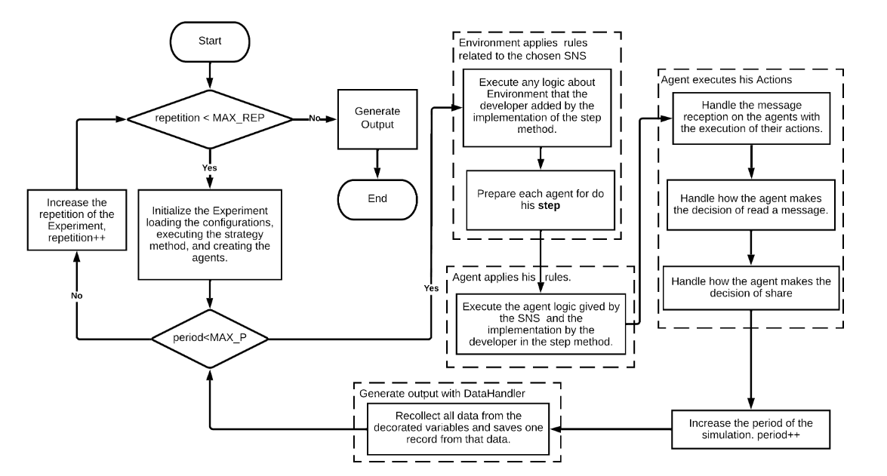

## The Word of Mouth Communication Process in Fasow.

The WOM communication process in Fasow depends on the interacting of the different components of fasow and by two principally
types of iterations, the repetitions and the ticks. Where each one manages a different concept of the time.

- Repetitions: Allows us to avoid the stochastic effect by repeating a simulation over and over again to generate different and
  random outputs to then weighting and standardize them.

- Ticks: Represent a discrete unit of time like one day, one hour, one second, one week, but usually is one day.

### The Fasow Process


<p align="center">Word of mouth communication process on Fasow</p>

With the use of the interaction of the different extensions of fasow,
we can start to draw a basic flow for their WOM communication process,
because we define a path to get a message, thinking about them, make the decision to share, and share them with his subscribers.
As this way we created a method to handle what an agent can do before, during and after they communicate information.

However, we also need to know and understand how this process beginnings, so is:

1. Select an experiment and run it
2. Initialize the repetitions from zero (0)
3. Initialize the Calibration of the model by execute his strategy and start to instantiate the Environment, Agent and Action extensions.
4. Start to iterate through the repetition of the model to avoid the stochastic effect.
5. Start validation of a correct initialization of the simulation
6. Run a simulation to iterate through the ticks of the simulation to understand the past of the time
7. Executes and applies the social network site logic and the seeds agents sends the first message.
8. Executes and applies the user logic to prepare them to receive information.
9. Executes the Actions of the Agents by handling the reception of a message.
10. Agents takes the decision to read the message.
11. Agents takes the decision to share the message
12. DataHandler is notified of the end of the tick and next tick is assigned
13. DataHandler query decorated variables and generate an iteration output row
14. DataHandler is notified of the end of the repetition, a new iteration output row is created and next repetition is assigned
15. DataHandler generates the output

<div style="max-height: 200px; overflow-y: auto;">

```

Experiment.Run()
initializeRepetitions()
Calibration.initialize():
Iteration type, Repetition:
  Simulation.isDone()?
  if !done:
    end repetitions;
  simulation.run():
  nextRepetition(): // repetitions+=1, and notifies data handler module to start querying the decorated variables.
  validateCanNextRepetition():
  initialize the Calibration model:

Calibration.initialize():
  
Simulation.isDone():
  is done is:
    the agents instances maintain the networkSize;
    the instances of seed maintain the seedSize;
    for each agent validate:
    followers or followings was mutated? from the percentage of the networkSize;

Simulation.run():
  this.environment.run():
    Environment.canNextTick(): //Tick iterations
      Environment.Step(): //And print step data
        Execute Environment extension.Step():
          Environment.agents.forEach(agent => agent.step())
            Agent.Step()
              Execute Agent extension.Step():
                Agent.forEach(action => action.execute())

EnvironmentExtension.Step():
  A way to define the sharing information process of the social network site, the 
  simples way to define this process is do:

step(): void {
  this.agents.forEach((agent) => {
    agent.step();
  });
}
Agent.Step():
this.agent.Actions.forEach((action) => {
  action.execute();
});
```

</div>

### Actions
We have two principal actions defined that are part of the WOM communication process of Fasow. The first is The READ action and the SHARE action,
that are logically the same, events that depends on the states of the agents, and a probability to happen or not. Thus, way we can define
different types of actions to create behaviors that adapts to our needs,  and modify our `Agents` and the `Environment`.

* `ActionRead`: Check the state of the agent that receives a message, and handles the switch of the state to `AgenState.READ` if the state of the agent is `AgenState.NOT_READ`

* `ActionShare`: Check the state of the agent that receives the message and if he had his state as `AgentState.READ`, indicates that the agent already has executed the `ActionRead`, and now we can handle how to send a message

<div style="max-height: 200px; overflow-y: auto;">

```typescript
/** Model/Action/WOM/ActionRead **/
export default class ActionRead extends Action {
  execute(agent: Agent): void {
    const aux: TwitterAgent = <TwitterAgent>agent;
    if (aux.state === AgentState.NOT_READ) {
      const p1: number = this.getRandom();
      if (p1 > 100 - this.probability) {
        aux.state = AgentState.READ;
      }
    }
  }
}
```
```typescript
/** Model/Action/WOM/ActionShare **/
export default class ActionShare extends Action {
  execute(agent: Agent): void {
    const aux: TwitterAgent = <TwitterAgent>agent;
    if (aux.state === AgentState.READ) {
      const p1: number = this.getRandom();
      if (p1 > 100 - this.probability) {
        aux.state = AgentState.READY_TO_SHARE;
      }
    }
  }
}
```
</div>

### AgentStates:
- NOT_READ: Indicates that the agent no have read some message and are be able to receive a message and read one.
- READ: Indicates that the agent already have read some message and that's it and now are be able to decide if SHARE or not with other the message.
- READY_TO_SHARE: Indicates that the Agent take the decision to share the message with their followers.
- SHARED: Indicates that the agent already shared a message with their followers.

```typescript
/**
 * Enumeration of the most simply states of an Agent in a WOM communication process.
 * NOT_READ = 0,
 * READ = 1,
 * READY_TO_SHARE = 2,
 * SHARED = 3
 */
export enum AgentState {
  NOT_READ,
  READ,
  READY_TO_SHARE,
  SHARED,
}
```
